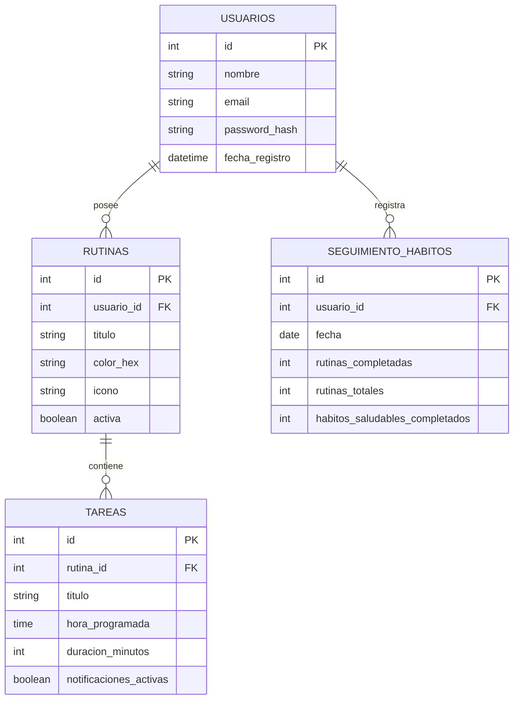

# Documentación Técnica: "Organiza tu Rutina" (React + Capacitor + MySQL)

Este documento contiene la arquitectura de software, el modelado de base de datos relacional (MySQL), la estructura del proyecto híbrido (React + Capacitor) y el análisis detallado de la interfaz de usuario basada en los wireframes provistos.

---

## 1. Arquitectura de Software

La aplicación móvil se construirá bajo una arquitectura de tres capas (Cliente Híbrido, Servidor de API, y Base de Datos Relacional).

```mermaid
graph TD
    subgraph Cliente Hibrido (React + Capacitor)
        UI[Componentes de UI / React.js]
        CapPlugs[Plugins Nativos de Capacitor]
        Axios[Cliente HTTP - Axios]
    end

    subgraph Servidor Backend (Node.js + Express)
        API[Rutas y Controladores de API]
        Auth[Autenticación JWT]
        ORM[ORM - Sequelize / Knex]
    end

    subgraph Base de Datos
        DB[(MySQL Database)]
    end

    UI --> Axios
    Axios --> API
    UI --> CapPlugs
    API --> Auth
    API --> ORM
    ORM --> DB
```

### Tecnologías Clave:
*   **Frontend (Cliente):** React.js con TypeScript, compilado con Vite y empaquetado para plataformas móviles (Android/iOS) usando **Capacitor**.
*   **Capacitor Plugins:**
    *   `@capacitor/local-notifications` para los recordatorios de actividades en el dispositivo.
    *   `@capacitor-community/calendar` para la sincronización con el calendario nativo.
    *   `@capacitor/preferences` para almacenamiento de tokens de sesión local (persistente).
*   **Backend (Servidor):** Node.js con Express, encargado de exponer la API REST de consumo.
*   **Base de Datos:** MySQL como motor relacional estructurado.
*   **Autenticación:** Sistema basado en tokens JWT (JSON Web Tokens) transmitidos en los headers de autorización HTTP.

---

## 2. Modelado de Datos (Base de Datos MySQL)

Se presenta el diseño relacional para persistir los datos de usuarios, rutinas, tareas individuales y el progreso semanal.

### Diagrama Entidad-Relación (Relacional)



### Script de Creación DDL (MySQL)

```sql
CREATE DATABASE IF NOT EXISTS organiza_tu_rutina;
USE organiza_tu_rutina;

-- Tabla de Usuarios
CREATE TABLE usuarios (
    id INT AUTO_INCREMENT PRIMARY KEY,
    nombre VARCHAR(100) NOT NULL,
    email VARCHAR(150) UNIQUE NOT NULL,
    password_hash VARCHAR(255) NOT NULL,
    fecha_registro TIMESTAMP DEFAULT CURRENT_TIMESTAMP
) ENGINE=InnoDB;

-- Tabla de Rutinas
CREATE TABLE rutinas (
    id INT AUTO_INCREMENT PRIMARY KEY,
    usuario_id INT NOT NULL,
    titulo VARCHAR(100) NOT NULL,
    color_hex VARCHAR(7) DEFAULT '#FAD3CF',
    icono VARCHAR(50) DEFAULT 'default-icon',
    activa BOOLEAN DEFAULT TRUE,
    FOREIGN KEY (usuario_id) REFERENCES usuarios(id) ON DELETE CASCADE
) ENGINE=InnoDB;

-- Tabla de Tareas vinculadas a las rutinas
CREATE TABLE tareas (
    id INT AUTO_INCREMENT PRIMARY KEY,
    rutina_id INT NOT NULL,
    titulo VARCHAR(150) NOT NULL,
    hora_programada TIME NOT NULL,
    duracion_minutos INT DEFAULT 0,
    notificaciones_activas BOOLEAN DEFAULT TRUE,
    FOREIGN KEY (rutina_id) REFERENCES rutinas(id) ON DELETE CASCADE
) ENGINE=InnoDB;

-- Tabla de Seguimiento diario para estadísticas
CREATE TABLE seguimiento_habitos (
    id INT AUTO_INCREMENT PRIMARY KEY,
    usuario_id INT NOT NULL,
    fecha DATE NOT NULL,
    rutinas_completadas INT DEFAULT 0,
    rutinas_totales INT DEFAULT 0,
    habitos_saludables_completados INT DEFAULT 0,
    UNIQUE KEY unica_fecha_usuario (usuario_id, fecha),
    FOREIGN KEY (usuario_id) REFERENCES usuarios(id) ON DELETE CASCADE
) ENGINE=InnoDB;
```

---

## 3. Estructura del Proyecto Híbrido

Se estructurará el repositorio en un monorepositorio que divide el desarrollo del backend API y del frontend móvil:

```text
organiza-tu-rutina/
├── backend/                  # Servidor API Node.js + Express
│   ├── config/               # Conexión a MySQL (Sequelize/Knex config)
│   ├── controllers/          # Lógica de negocio (authController, routineController)
│   ├── middleware/           # Validación de JWT y control de errores
│   ├── models/               # Definición de tablas de la base de datos
│   ├── routes/               # Endpoints expuestos (/api/auth, /api/routines)
│   ├── .env                  # Variables de entorno (DB_HOST, JWT_SECRET)
│   ├── index.js              # Archivo de entrada de Express
│   └── package.json
│
├── frontend/                 # Aplicación móvil React.js (Vite) + Capacitor
│   ├── android/              # Carpeta de plataforma nativa Android (generada por Capacitor)
│   ├── ios/                  # Carpeta de plataforma nativa iOS (generada por Capacitor)
│   ├── src/
│   │   ├── assets/           # Elementos gráficos e iconos
│   │   ├── components/       # UI Reutilizable (Switch, Cards, Custom Modal)
│   │   ├── hooks/            # Hooks personalizados (useAuth, useRoutines)
│   │   ├── pages/            # Vistas: Home, Progreso, Recordatorios, Bienestar
│   │   ├── services/         # Cliente HTTP (Axios) e integración de plugins Capacitor
│   │   ├── theme/            # Paleta de colores e identidades visuales
│   │   ├── App.tsx           # Enrutador principal y configuración general
│   │   └── main.tsx
│   ├── capacitor.config.ts   # Configuración de Capacitor
│   ├── tailwind.config.js    # Configuración de estilos Tailwind
│   └── package.json
```

---

## 4. Análisis de la Interfaz de Usuario (UI/UX)

Basándonos en la propuesta visual, detallamos las observaciones críticas para el desarrollo frontend:

### 4.1. Pantalla 1: Home & Routines (Inicio y Rutinas)
*   **Elementos Visuales:** Cabecera con saludo personalizado ("Organiza tu Rutina", "Lunes, 15 Junio"), widget de notificaciones, carrusel de rutinas activas ("Mañana Productiva", "Estudio Enfocado", "Descanso Bienestar") con navegación manual deslizante, y un botón central flotante `+`.
*   **Ajustes Críticos de UX/UI:**
    *   *Corrección Ortográfica:* Corregir la etiqueta del botón menta inferior: **"Crear nuew rutina"** $\rightarrow$ **"Crear nueva rutina"**.
    *   *Navegación Móvil:* Al ser una app empaquetada con Capacitor, los eventos táctiles (swiping) para el carrusel de rutinas deben configurarse con librerías optimizadas para móvil (ej. `Swiper.js` en React).

### 4.2. Pantalla 2: Análisis de Progreso
*   **Elementos Visuales:** Gráfico circular de progreso y gráfico de barras por día de la semana.
*   **Ajustes Críticos de UX/UI:**
    *   *Valores del Gráfico:* El gráfico circular representa *75% Completo* y *23% Pendiente*. Deben corregirse los datos de backend para asegurar que la sumatoria represente el 100% de manera estricta.
    *   *Errores Tipográficos:* En el eje X del gráfico de barras semanal, corregir `"Lures", "Lun", "Mars", "Jum", "Vien", "Dlas", "Dias"` por una secuencia clara en español: `"Lun", "Mar", "Mié", "Jue", "Vie", "Sáb", "Dom"`. Utilizar componentes gráficos responsivos como `Recharts` o `Chart.js` adaptados al contenedor CSS.

### 4.3. Pantalla 3: Gestión de Recordatorios
*   **Elementos Visuales:** Lista de recordatorios del día con interruptores interactivos y un botón para engranar la sincronización nativa de calendario.
*   **Ajustes Críticos de UX/UI:**
    *   *Error Ortográfico:* Modificar el título **"Próximos yorriradores"** por **"Próximos recordatorios"**.
    *   *Secuencia de Calendario:* Ajustar los números de días del calendario semanal horizontal. Actualmente dice `15, 16, 27, 28, 29, 30, 31`. Debe ser correlativo: `15, 16, 17, 18, 19, 20, 21`.
    *   *Sincronización:* Al presionar "Sincronizar Calendario", la app llamará al plugin nativo `@capacitor-community/calendar` para solicitar permisos de lectura/escritura e insertar los eventos programados en el calendario por defecto del sistema operativo móvil.

### 4.4. Pantalla 4: Descubrir Bienestar & Perfil
*   **Elementos Visuales:** Tarjetas de recursos informativos, opción para compartir dinámicamente y barra de usuario.
*   **Ajustes Críticos de UX/UI:**
    *   *Pie de página:* Cambiar el texto explicativo de las maquetas **"PROPOSAL & PORFIL"** por **"PROPUESTA & PERFIL"** o **"PROPOSAL & PROFILE"** para mantener consistencia académica y profesional.
