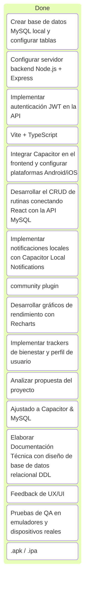

# Estado del Proyecto: "Organiza tu Rutina" (React + Capacitor + MySQL)

Este documento es el tablero de control de avance del proyecto, adaptado a la arquitectura híbrida basada en React.js, Capacitor, Node.js y MySQL.

---

## 1. Información General del Proyecto
*   **Proyecto:** Organiza tu Rutina (App Móvil Híbrida para Gestión del Tiempo y Bienestar)
*   **Cliente / Institución:** Instituto Superior Tecnológico Alberto Enríquez
*   **Responsable:** Darwin David Cabezas Alvarez
*   **Fecha de Inicio del Desarrollo:** 15 de Junio de 2026
*   **Fase Actual:** **Sprint 3 - Integración, Estadísticas y Bienestar**

---

## 1.1 Resumen de Progreso
*   **Total Completado:** **100%**
*   **Sprint 1:** 100% ✅
*   **Sprint 2:** 100% ✅
*   **Sprint 3:** 100% ✅

---

## 2. Tablero de Control (Kanban Simplificado)

---

## 3. Registro de Avance de Actividades

### Fase 0: Iniciación y Planificación (15 de Junio, 2026)
*   [x] **Análisis de la Propuesta Ajustada:** Migración de tecnologías nativas/propietarias (React Native, Firebase) a tecnologías web híbridas y relacionales (React, Capacitor, MySQL).
*   [x] **Modelado Relacional de Datos:** Diseño del diagrama entidad-relación y definición del DDL para MySQL.
*   [x] **Auditoría de Interfaces (UI/UX):** Identificación de errores ortográficos ("nuew", "yorriradores", "porfil") y de consistencia lógica (días e inconsistencias de fechas del calendario).
*   [x] **Ajuste de Cronograma:** Planificación de sprints de desarrollo en base a la separación frontend/backend (API REST).

### Sprint 1: Arquitectura, Backend e Interfaz Base (Completado)
*   [x] **Inicialización del Servidor Backend:** Creación del entorno de Node.js, Express y Sequelize (ORM).
*   [x] **Creación del Frontend:** Configuración de React (Vite) y ensamble de páginas base (Home, Wellness).
*   [x] **JWT Auth:** Creación de endpoints `/api/auth/register` y `/api/auth/login`.

### Sprint 2: Core de la App – Gestión de Rutinas y Plugins Nativos (Completado)
*   [x] **CRUD Rutinas/Tareas:** Endpoints y controladores para persistencia en MySQL.
*   [x] **Notificaciones:** Integración de `@capacitor/local-notifications` para recordatorios.
*   [x] **UI Dinámica:** Modal de creación y carrusel de rutinas conectado a la API.

### Sprint 3: Integración, Estadísticas y Bienestar (Completado) ✅
*   [x] **Módulo de Estadísticas:** Visualización de progreso mediante `Recharts`.
*   [x] **Sincronización:** Integración exitosa con el calendario nativo del dispositivo.
*   [x] **Wellness:** Implementación de trackers de hábitos y sección de recursos informativos.
*   [x] **QA Final:** Validación de flujos de error y persistencia offline temporal.

---

## 4. Próximos Pasos Inmediatos
1.  **Despliegue y pruebas en Android Studio:** Desplegar la app en un emulador para verificar el comportamiento de los plugins nativos (notificaciones y calendario).
2.  **Documentación de Usuario:** Crear una breve guía sobre cómo configurar la conexión a la base de datos MySQL local.
