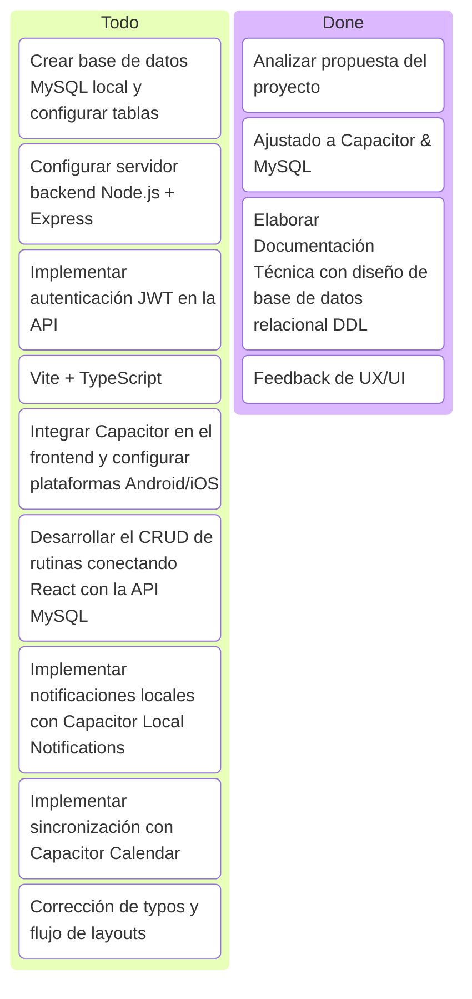

# Estado del Proyecto: "Organiza tu Rutina" (React + Capacitor + MySQL)

Este documento es el tablero de control de avance del proyecto, adaptado a la arquitectura híbrida basada en React.js, Capacitor, Node.js y MySQL.

---

## 1. Información General del Proyecto
*   **Proyecto:** Organiza tu Rutina (App Móvil Híbrida para Gestión del Tiempo y Bienestar)
*   **Cliente / Institución:** Instituto Superior Tecnológico Alberto Enríquez
*   **Responsable:** Darwin David Cabezas Alvarez
*   **Fecha de Inicio del Desarrollo:** 15 de Junio de 2026
*   **Fase Actual:** **Fase 0 - Iniciación, Diseño y Planificación (Tecnologías Ajustadas)**

---

## 2. Tablero de Control (Kanban Simplificado)

---

## 3. Registro de Avance de Actividades

### Fase 0: Iniciación y Planificación (15 de Junio, 2026)
*   [x] **Análisis de la Propuesta Ajustada:** Migración de tecnologías nativas/propietarias (React Native, Firebase) a tecnologías web híbridas y relacionales (React, Capacitor, MySQL).
*   [x] **Modelado Relacional de Datos:** Diseño del diagrama entidad-relación y definición del DDL para MySQL.
*   [x] **Auditoría de Interfaces (UI/UX):** Identificación de errores ortográficos ("nuew", "yorriradores", "porfil") y de consistencia lógica (días e inconsistencias de fechas del calendario).
*   [x] **Ajuste de Cronograma:** Planificación de sprints de desarrollo en base a la separación frontend/backend (API REST).

### Sprint 1: Arquitectura, Backend e Interfaz Base (Próxima Fase)
*   [ ] **Inicialización del Servidor Backend:** Creación del entorno de Node.js, Express y Sequelize (ORM).
*   [ ] **Creación del Frontend:** Configuración de React (Vite) + Tailwind CSS y ensamble inicial del CLI de Capacitor.
*   [ ] **JWT Auth:** Creación de endpoints `/api/auth/register` y `/api/auth/login`.

---

## 4. Próximos Pasos Inmediatos
1.  **Revisión y Aprobación del Repositorio:** Subir los archivos actualizados (`plan_desarrollo.md`, `documentacion_tecnica.md`, `estado_proyecto.md`).
2.  **Configurar Base de Datos:** Crear la base de datos `organiza_tu_rutina` en un servidor local MySQL (como XAMPP o Docker) utilizando el script DDL provisto.
3.  **Setup Técnico del Monorepositorio:** Crear las carpetas `/backend` y `/frontend` para comenzar la implementación estructurada.
