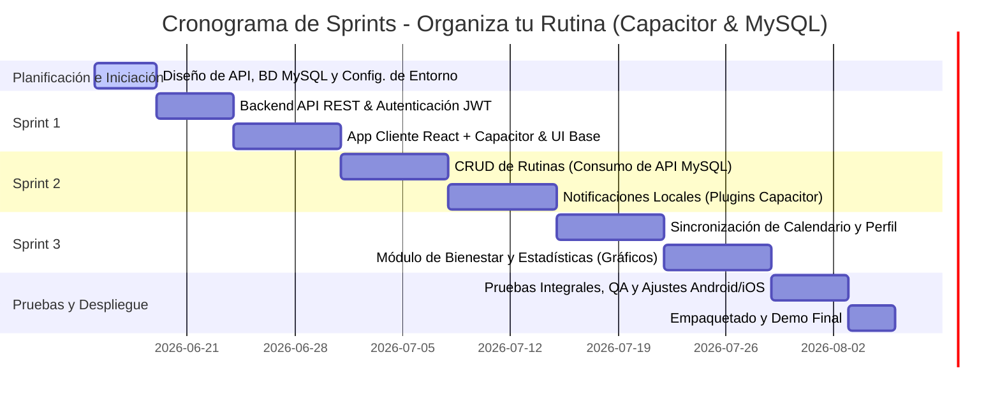

# Plan de Desarrollo: "Organiza tu Rutina" (React + Capacitor + MySQL)

Este documento establece la planificación para el desarrollo de la aplicación móvil híbrida de gestión del tiempo y bienestar estudiantil utilizando React.js, Capacitor y una base de datos relacional MySQL.

---

## 1. Metodología de Trabajo (Agile - Scrum)

El proyecto se gestionará utilizando la metodología **Scrum** con un ciclo total de **6 semanas**, estructurado en **3 Sprints de 2 semanas cada uno**.

### Roles y Responsabilidades
*   **Product Owner / Cliente:** Instituto Superior Tecnológico Alberto Enríquez (Estudiantes/Tutores).
*   **Responsable de Desarrollo (Scrum Master & Dev):** Darwin David Cabezas Alvarez.

---

## 2. Cronograma General de Sprints

---

## 3. Detalle de los Sprints

### Sprint 1: Arquitectura, Backend (API + MySQL) e Interfaz Base
**Objetivo:** Configurar la base de datos MySQL, crear el backend de autenticación JWT y estructurar la interfaz cliente en React con Capacitor.
*   **Semana 1-2 (19 de Junio - 30 de Junio)**
    *   **Tarea 1.1:** Diseñar y desplegar la base de datos MySQL local/remota (Tablas de usuarios y sesiones).
    *   **Tarea 1.2:** Desarrollar el backend en Node.js (Express) para el registro, login y generación de tokens JWT.
    *   **Tarea 1.3:** Inicializar la aplicación web React.js (usando Vite y TypeScript) y configurar **Capacitor** para compilación híbrida.
    *   **Tarea 1.4:** Crear componentes visuales en React (Tailwind CSS/CSS Custom Properties) ajustados a la guía de UI.
    *   **Tarea 1.5:** Implementar la pantalla **Home & Routines** en el cliente React consumiendo datos estáticos mientras se enlaza el backend.

### Sprint 2: Core de la App – Gestión de Rutinas y Plugins Nativos
**Objetivo:** Desarrollar el API de gestión de rutinas, integrarlo con el cliente y configurar recordatorios locales usando plugins nativos de Capacitor.
*   **Semana 3-4 (1 de Julio - 14 de Julio)**
    *   **Tarea 2.1:** Diseñar las tablas de `rutinas` y `tareas` en MySQL con llaves foráneas correspondientes.
    *   **Tarea 2.2:** Desarrollar los endpoints del Backend para CRUD de rutinas y tareas (`GET`, `POST`, `PUT`, `DELETE`).
    *   **Tarea 2.3:** Conectar el cliente React con los endpoints de rutinas para permitir la creación, edición y eliminación visual.
    *   **Tarea 2.4:** Integrar el plugin `@capacitor/local-notifications` para programar recordatorios automáticos en el móvil.
    *   **Tarea 2.5:** Desarrollar los interruptores lógicos en React para activar/desactivar recordatorios interactuando con Capacitor.

### Sprint 3: Integración de Sistemas, Estadísticas y Bienestar
**Objetivo:** Implementar la sincronización de calendario, sección informativa de bienestar y visualización gráfica del progreso.
*   **Semana 5-6 (15 de Julio - 28 de Julio)**
    *   **Tarea 3.1:** Implementar la integración de calendario nativo mediante el plugin `@capacitor-community/calendar`.
    *   **Tarea 3.2:** Diseñar e integrar la base de datos de registro de hábitos y crear endpoints para estadísticas históricas.
    *   **Tarea 3.3:** Crear gráficos de rendimiento en React (`Chart.js` o `Recharts`) adaptados al diseño móvil de progreso.
    *   **Tarea 3.4:** Implementar el módulo "Descubrir Bienestar" y la pantalla de perfil del estudiante Darwin Cabezas.

---

## 4. Gestión de Riesgos y Mitigación

| Riesgo Detectado | Probabilidad | Impacto | Estrategia de Mitigación |
| :--- | :---: | :---: | :--- |
| **Pérdida de conexión a internet para escribir en MySQL** | Alta | Alto | Implementar persistencia local temporal usando `Capacitor Preferences` o `SQLite` en el cliente, sincronizando con el servidor al recuperar conexión. |
| **Problemas de CORS entre el cliente React y la API Node/MySQL** | Media | Medio | Configurar adecuadamente el middleware de `cors` en Express y configurar la URL base de manera dinámica en la app móvil. |
| **Incompatibilidad de plugins nativos de Capacitor en iOS/Android** | Baja | Alto | Validar tempranamente los plugins de notificaciones y calendario en emuladores reales de Android (Android Studio) y iOS (Xcode). |
